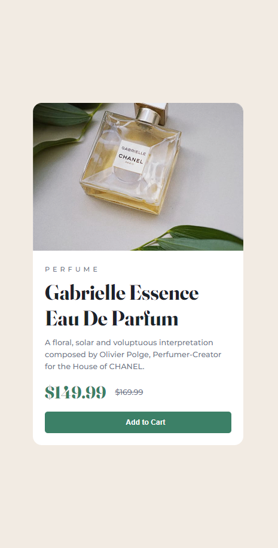

# Frontend Mentor - Product preview card component solution

This is a solution to the [Product preview card component challenge on Frontend Mentor](https://www.frontendmentor.io/challenges/product-preview-card-component-GO7UmttRfa). Frontend Mentor challenges help you improve your coding skills by building realistic projects.

## Table of contents

- [Overview](#overview)
  - [The challenge](#the-challenge)
  - [Screenshot](#screenshot)
  - [Links](#links)
- [My process](#my-process)
  - [Built with](#built-with)
  - [What I learned](#what-i-learned)
- [Author](#author)

## Overview

### The challenge

Users should be able to:

- View the optimal layout depending on their device's screen size
- See hover and focus states for interactive elements

### Screenshot




### Links

- Solution URL: [Solution URL](https://github.com/TrEv0rRrRr/preview-card-component)
- Live Site URL: [Live site URL](https://trev0rrrrr.github.io/preview-card-component/)

## My process

### Built with

- Semantic HTML5 markup
- CSS custom properties
- Flexbox

### What I learned

```css
@media screen and (min-width: 768px) {
  .container {
    display: flex;
    flex-direction: row;
    max-width: 32rem;
    margin: 0;
  }
}

@media screen and (min-width: 768px) {
  .img-mobile {
    border-top-right-radius: 0;
    border-bottom-left-radius: 15px;
  }
}

@media screen and (min-width: 768px) {
  main {
    max-width: 14rem;
  }
}
```

## Author

- Frontend Mentor - [@TrEv0rRrRr](https://www.frontendmentor.io/profile/TrEv0rRrRr)
